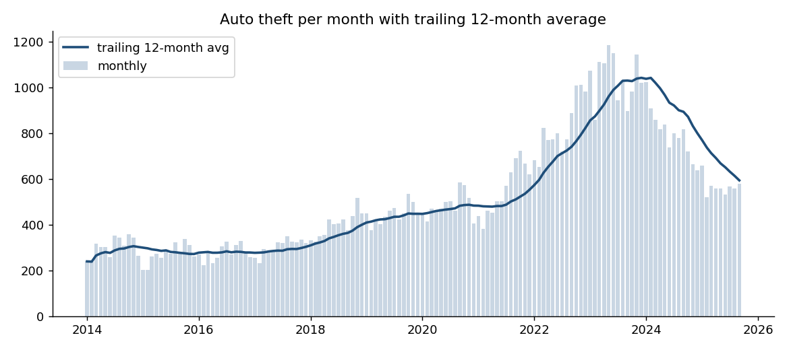
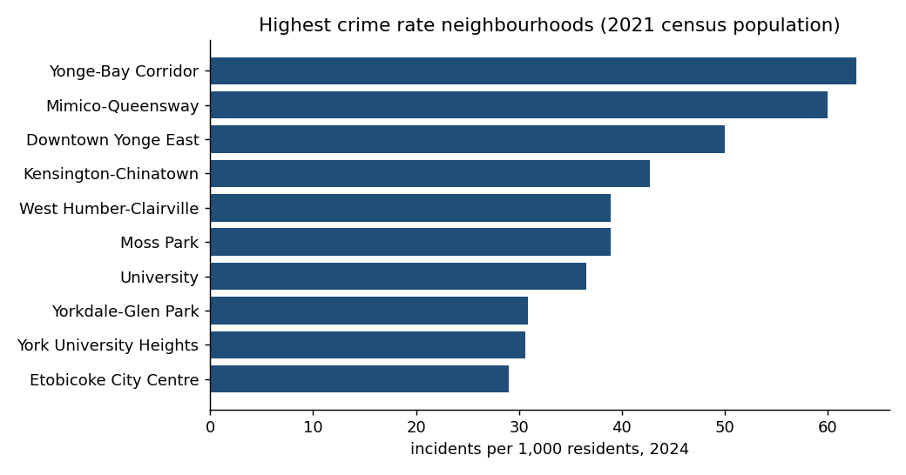
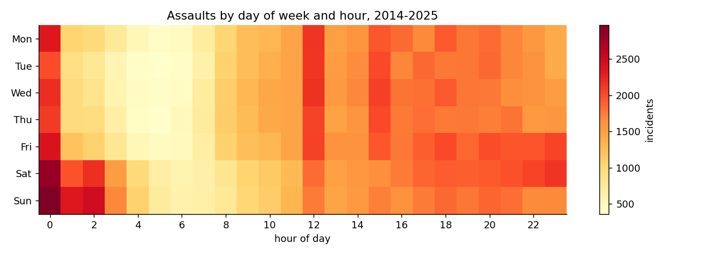

# Findings: Toronto Major Crime Indicators, 2014–2025

Twenty questions, answered in SQL against 452,949 police-reported incidents. Full query and
result for each is in [`results/`](results/). Numbers below are from the 2026-09-22 snapshot.

## 1. The auto theft wave is the story of the decade

Auto theft rose every single year from 2017 to 2023 — 3,647 → 12,520, a 243% increase — and
the 2021→2022 jump (+48.8%) is the largest single-year change of any category in the dataset
([Q1](results/01_incidents_by_year_and_category.md), [Q2](results/02_yoy_change_by_category.md)).
It peaked at 1,188 thefts in one month (early 2023), then fell 23% in 2024 and the trailing
12-month average is now back near 600 ([Q8](results/08_auto_theft_rolling_12m.md)).

The growth was not evenly spread. Among neighbourhoods with at least 50 thefts in 2019,
**Bedford Park-Nortown (+273%)**, **Milliken (+272%)** and **Newtonbrook West (+261%)** grew
fastest — affluent or suburban areas, consistent with targeted theft of high-value vehicles
rather than opportunistic crime ([Q13](results/13_fastest_growing_auto_theft_neighbourhoods.md)).

## 2. Break-and-enters moved from houses to businesses, then partly back

In 2014, 27% of break-and-enters were at commercial premises and 41% at houses. By 2021
commercial had risen to 42% while house break-ins had fallen by more than half (2,947 → 1,166).
House break-ins recovered to 2,121 in 2024 ([Q17](results/17_break_and_enter_premises_trend.md)).

## 3. Hotspots are persistent — but ranking by rate changes the picture

Of the 20 busiest neighbourhoods in 2014, **17 were still in the top 20 in 2024**. The three
that dropped out (Black Creek, Kennedy Park, Eglinton East) were replaced by Mimico-Queensway,
St Lawrence-East Bayfront-The Islands and Yorkdale-Glen Park
([Q19](results/19_hotspot_persistence.md)). Mimico-Queensway is the notable mover: rank 26 in
2019 to rank 2 in 2024 ([Q6](results/06_neighbourhood_rank_change.md)).

Per 1,000 residents, the ranking is dominated by downtown neighbourhoods with small resident
populations and large daytime populations: **Yonge-Bay Corridor (62.8)**, Mimico-Queensway
(60.0), Downtown Yonge East (50.0) ([Q7](results/07_crime_rate_per_1000.md)). Any per-resident
rate for a downtown core overstates risk to residents; a per-visitor denominator would be better
but does not exist in open data.

## 4. Neighbourhood Improvement Areas: higher, but not dramatically

The City's 31 designated NIAs had 17.8 incidents per 1,000 residents in 2024 versus 16.7 for
the 115 non-designated neighbourhoods — about 7% higher. "Emerging Neighbourhoods" were
lowest at 12.1 ([Q14](results/14_nia_vs_non_nia.md)).

## 5. When crime happens

- **Assault** peaks at midnight (16,826 incidents at hour 0) and is 13% more frequent per day
  on weekends than weekdays ([Q4](results/04_peak_hours_by_category.md), [Q15](results/15_weekend_vs_weekday.md)).
- **Auto theft** peaks 21:00–23:00 and is *lower* on weekends (15.3 vs 17.8 per day).
- **Break and enter** clusters at 00:00 and 03:00–04:00.
- **Robbery** peaks 19:00–21:00.
- Seasonality is mild: July assaults index at 110 vs January at 95. Auto theft peaks in
  October–November (111), not summer ([Q3](results/03_seasonality_index.md)).

## 6. Reporting lag differs by crime type

Robbery is reported same-day 87% of the time; Theft Over only 31%, with a median lag of two
days and a 90th percentile of 53 days — consistent with thefts discovered during audits or
inventory counts ([Q10](results/10_reporting_lag_percentiles.md)).

## 7. Data caveats found along the way

- One police event can produce several offence rows: 11.5% of events have two or more.
  452,949 rows represent 394,433 events. Counting rows overstates "crimes" by ~15%
  ([Q11](results/11_multi_offence_events.md)).
- 1.6% of rows have no neighbourhood ("NSA") and 1.5% have zeroed coordinates.
- 1,720 rows have occurrence dates before 2014 (late-reported historical cases); they are
  excluded from trend queries ([Q20](results/20_data_quality_profile.md)).
- 2025 is a partial year and is excluded from year-over-year comparisons.
- Population is the 2021 census; rates for other years use it as a fixed denominator.

## SQL techniques used

Window functions (`LAG`, `RANK`, `ROW_NUMBER`, `SUM/AVG/STDDEV OVER`, frame clauses), CTEs,
conditional aggregation with `FILTER`, `QUANTILE_CONT`, `FULL OUTER JOIN`, top-N per group,
running totals, z-score anomaly detection, and a data-profiling query.
