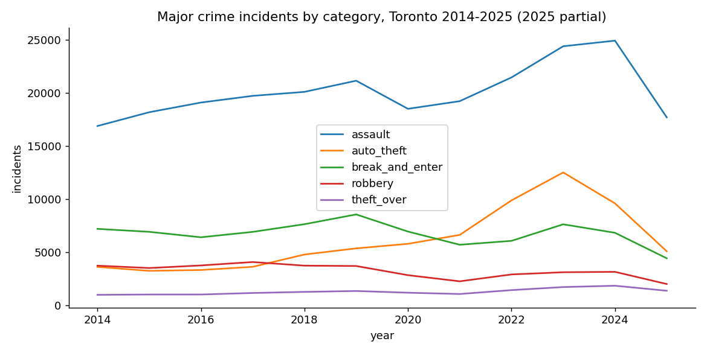

# Toronto Crime SQL Analytics

**Start here:** [Live dashboard](https://prhoguns.github.io/toronto-crime-sql-analytics/) · [Findings](FINDINGS.md) · [Portfolio case study](https://rhoguns.orhogun.workers.dev/case-studies/toronto-crime-sql-analytics.html)

**What I did:** I framed twenty questions, wrote one SQL query for each, built the DuckDB workflow and published result tables and charts. In the 22 September 2026 snapshot, the analysis covers 452,949 police-reported incident rows. The findings document data caveats, including multiple offence rows per event and the limits of per-resident neighbourhood rates.

_Portfolio sprint timeline: January–September 2026. Reported results retain their actual run dates._

Twenty business questions about a decade of Toronto police data, each answered with one SQL
query. Self-contained: DuckDB, one CSV, one command.

**Read the results:** [FINDINGS.md](FINDINGS.md) · per-question output in [`results/`](results/)

| | |
|---|---|
| Data | [Major Crime Indicators](https://open.toronto.ca/dataset/major-crime-indicators/) (452,949 rows, 2014–2025) + [2021 Neighbourhood Profiles](https://open.toronto.ca/dataset/neighbourhood-profiles/) (population, income) |
| Engine | DuckDB 1.1 (queries are ANSI SQL; they run on PostgreSQL with minor function-name changes) |
| Output | Markdown result tables, four matplotlib charts |



## Run it

```bash
git clone https://github.com/prhoguns/toronto-crime-sql-analytics.git
cd toronto-crime-sql-analytics
docker build -t crime-sql .
docker run --rm -v "$PWD":/app --entrypoint python crime-sql scripts/download.py   # ~135 MB
docker run --rm -v "$PWD":/app --entrypoint python crime-sql scripts/build_db.py
docker run --rm -v "$PWD":/app crime-sql              # runs all 20 queries + charts
docker run --rm -v "$PWD":/app crime-sql 08 16        # just two of them
```

Without Docker: `pip install -r requirements.txt` then the same `python scripts/...` commands.

## The questions

| # | Question | Technique |
|---|---|---|
| [01](sql/01_incidents_by_year_and_category.sql) | Yearly trend per category | conditional aggregation (pivot) |
| [02](sql/02_yoy_change_by_category.sql) | Year-over-year % change | `LAG()` |
| [03](sql/03_seasonality_index.sql) | Seasonality index by month | windowed average |
| [04](sql/04_peak_hours_by_category.sql) | Top 3 hours per category | `ROW_NUMBER()` top-N |
| [05](sql/05_weekday_hour_heatmap.sql) | Day × hour heatmap | two-dimensional grouping |
| [06](sql/06_neighbourhood_rank_change.sql) | Rank change 2019 → 2024 | `RANK()` in two CTEs |
| [07](sql/07_crime_rate_per_1000.sql) | Rate per 1,000 residents | join to census, `UNION ALL` |
| [08](sql/08_auto_theft_rolling_12m.sql) | Trailing 12-month average | window frame `ROWS BETWEEN` |
| [09](sql/09_premises_share_by_category.sql) | Premises share within category | `SUM() OVER (PARTITION BY)` |
| [10](sql/10_reporting_lag_percentiles.sql) | Reporting lag percentiles | `QUANTILE_CONT` |
| [11](sql/11_multi_offence_events.sql) | Multi-offence events | aggregate of an aggregate |
| [12](sql/12_division_cumulative_share.sql) | Division Pareto | running total |
| [13](sql/13_fastest_growing_auto_theft_neighbourhoods.sql) | Fastest-growing auto theft | `HAVING` on filtered count |
| [14](sql/14_nia_vs_non_nia.sql) | Improvement areas vs rest | population-weighted rate |
| [15](sql/15_weekend_vs_weekday.sql) | Weekend vs weekday | normalised per-day rate |
| [16](sql/16_neighbourhood_monthly_spikes.sql) | Anomalous months (z > 3) | `AVG`/`STDDEV` windows |
| [17](sql/17_break_and_enter_premises_trend.sql) | B&E premises shift | conditional aggregation |
| [18](sql/18_top_offences_within_category.sql) | Top offences per category | `ROW_NUMBER` + windowed share |
| [19](sql/19_hotspot_persistence.sql) | Hotspot persistence | `FULL OUTER JOIN` |
| [20](sql/20_data_quality_profile.sql) | Data quality profile | `FILTER` clauses |

## Layout

```
sql/          one question per file, comment header states the question and the technique
results/      generated: question, query, result table
charts/       generated PNGs
scripts/      download.py · build_db.py · run.py
```

Data is published under the [Open Government Licence – Toronto](https://open.toronto.ca/open-data-license/).

## Acknowledgments

AI tools assisted with documentation and repository organization.
